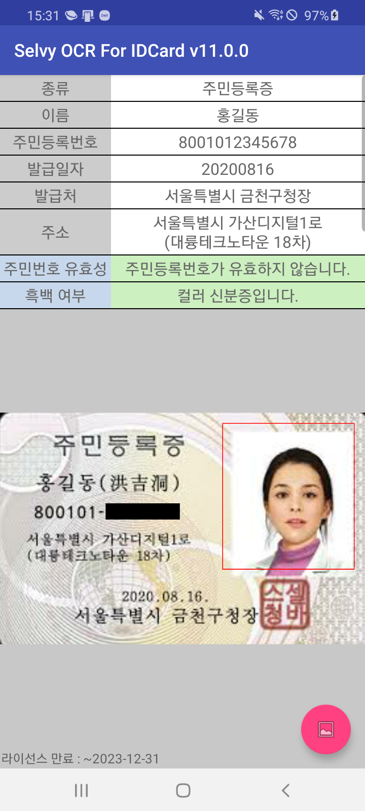

# 신분증 인식기 안드로이드 예제
본 문서는 신분증 인식기 SDK 에 대한 기술적인 정보를 제공하고 SDK 를 사용하여 어플리케이션에
신분증 인식 기능을 빠르게 구현할 수 있는 방법을 설명한다.

## 실행 환경
- 운영 체제: Android 5.0 이상의 ARM CPU 기반 장치
- 인식 대상: 신/구 운전 면허증, 주민등록증, 외국인 등록증
- 런타임 메모리(RAM): 100MB ~ 240MB(Samsung Galaxy S7 기준)
- ROM: 3.0MB 이하
- 예제 개발 환경: Android Studio

## 문서
The **Selvy OCR SDK** API documentation is available on [Selvy OCR website](http://ocr.selvasai.com)

## Screenshot
* 실행

* 이미지 선택

* 결과

## License
© 2020. [SELVAS AI Inc.](http://www.selvasai.com) All Rights Reserved.
